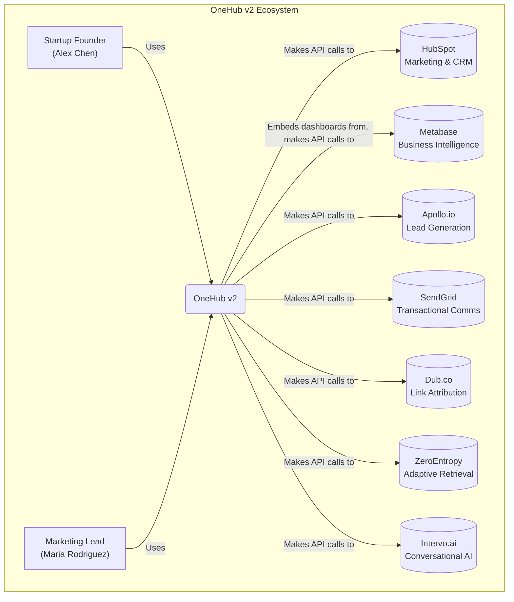
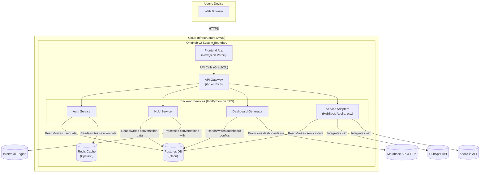

# OneHub v2 - System Architecture (C4 Model)

This document outlines the high-level architecture of the OneHub v2 platform using the C4 model. This approach allows us to visualize the system at different levels of abstraction, providing a clear understanding for technical and non-technical stakeholders alike.

---

## Level 1: System Context Diagram

This diagram shows OneHub as a black box in the center of the universe. It illustrates how our system interacts with our users and the other systems it depends on.

---

## Level 2: Container Diagram

This diagram zooms into the OneHub v2 system, showing the major logical containers (applications, services, data stores) that make up the platform.

